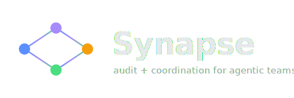

<div align="center">



**The audit + coordination layer for agentic teams that span vendors.**
One Synapse session, ten different framework SDKs, one unified envelope log.

[](LICENSE)
[](https://www.python.org/)
[](https://github.com/arajgor1/synapse/releases/tag/v0.2.8)
[](spec/protocol-v1.0/)
[](sdk-python/tests/)
[](sdk-python/synapse/frameworks/)
[](bench/results/v32_app_bundle/)
[](bench/results/v32_app_bundle/main.py)
[](https://github.com/arajgor1/synapse/discussions)
[](https://github.com/arajgor1/synapse)

### ⭐ Star · 🍴 Fork · 💬 [Discussions](https://github.com/arajgor1/synapse/discussions) · 📖 [Benchmark](bench/PUBLIC_BENCHMARK.md) · 🧪 [v32 bundle](bench/results/v32_app_bundle/)

> **Coordinate, audit, and prove what your agents did — across any vendor SDK.** Synapse sits above AutoGen, CrewAI, LangGraph, smolagents, Agno, LlamaIndex, Pydantic AI, OpenAI Agents SDK, Google ADK, and Hermes — and emits one unified envelope log no matter which one your agents ran on.

🌍 [🇺🇸 English](README.md) · [🇩🇪 DE](https://readme-i18n.com/arajgor1/synapse?lang=de) · [🇫🇷 FR](https://readme-i18n.com/arajgor1/synapse?lang=fr) · [🇪🇸 ES](https://readme-i18n.com/arajgor1/synapse?lang=es) · [🇨🇳 ZH](https://readme-i18n.com/arajgor1/synapse?lang=zh) · [🇯🇵 JA](https://readme-i18n.com/arajgor1/synapse?lang=ja) · [🇰🇷 KO](https://readme-i18n.com/arajgor1/synapse?lang=ko) · [🇮🇳 HI](https://readme-i18n.com/arajgor1/synapse?lang=hi) · [🇸🇦 AR](https://readme-i18n.com/arajgor1/synapse?lang=ar) · [🇷🇺 RU](https://readme-i18n.com/arajgor1/synapse?lang=ru) · [🇧🇷 PT](https://readme-i18n.com/arajgor1/synapse?lang=pt) · [🇮🇹 IT](https://readme-i18n.com/arajgor1/synapse?lang=it)

</div>

---

## The Problem

AI agentic teams today span multiple vendor SDKs. There's no audit layer that crosses them.

- ❌ **Vendor-specific traces** — LangSmith logs LangChain; Phoenix logs OpenInference; Helicone logs OpenAI. None of them spans ten SDKs in one session.
- ❌ **No unified `who did what`** — when an AutoGen agent and a CrewAI agent collaborate on the same task, no tool gives you both in one log.
- ❌ **Silent collisions** — two agents write to the same scope; the last writer wins; nobody notices until production breaks.
- ❌ **No compliance artifact** — when a regulator asks "what did the agentic team do?", you can't hand them a single source of truth.
- ❌ **No reasoning capture** — even when models emit thinking blocks (Anthropic extended thinking, o-series reasoning), most pipelines drop them.

## The Solution

Synapse is a thin coordination + audit protocol you add **above** your existing framework SDKs.

- ✅ **One envelope log across vendors** — INTENTION, THOUGHT, RESOLUTION, CONFLICT, PIVOT, BELIEF, COST_REPORT envelopes from every adapter land in one Postgres + Redis pair.
- ✅ **10 vendor SDKs proven cooperating** — see the [v32 cooperative-build bundle](bench/results/v32_app_bundle/) where 10 framework agents collaboratively built a Flask app that actually runs.
- ✅ **LLM reasoning captured natively** — Anthropic extended thinking + o-series reasoning + PSEUDO_THOUGHT fallback for plain text models. HuggingFace logits/attention/hidden-states for self-hosted.
- ✅ **Conflict detection + auto-merge** — the L2 router catches collisions before they corrupt your output. `MergePolicy.auto_merge` uses your LLM to reconcile.
- ✅ **Audit existing traces too** — `synapse audit ./traces.json` reads OpenInference / LangSmith / Bedrock / Vertex / Azure / JSONL.

> Sits next to — not against — the observability tools you already use. We're the audit + coordination layer; they're the call-level trace layer. They're complementary.

---

## What just landed (v0.2.8)

**Ten agents from ten different framework SDKs collaborated on one Synapse
session to build a Flask Todo app — and the app actually runs.**

The produced [`bench/results/v32_app_bundle/main.py`](bench/results/v32_app_bundle/main.py)
serves `GET /todos → 200`. The [`envelopes.jsonl`](bench/results/v32_app_bundle/envelopes.jsonl)
carries INTENTION envelopes from `autogen_default`, `backend_engineer`
(crewai), `tools` (langgraph), `agent` (pydantic_ai), and others — one
unified audit log across vendors. End-to-end timeline in
[`bench/PUBLIC_BENCHMARK.md`](bench/PUBLIC_BENCHMARK.md#phase-10--v028-zero-backlog-convergence-v21v28-2026-05-12).

| | Result |
|---|---|
| Vendor SDKs cooperating | **10** — AutoGen, CrewAI, LangGraph, smolagents, Agno, LlamaIndex, Pydantic AI, OpenAI Agents SDK, Google ADK, Hermes |
| Files produced | **10/10** (8 direct + 2 via fallback) |
| Synapse INTENTIONs persisted | **8** in Postgres, all vendor-tagged |
| App runs (Flask test_client) | ✅ `GET /todos → 200` |
| Convergence bench (v26 ↔ v27) | **10/10 V1_PASS deterministic, byte-for-byte reproducible** |

Reproduce locally in ~10 seconds:

```bash
git clone https://github.com/arajgor1/synapse && cd synapse
pip install flask
cd bench/results/v32_app_bundle
python -c "import main; print(main.app.test_client().get('/todos').status_code)"
# → 200
```

---

## Try it in 60 seconds — no infra, no env vars

```bash
pip install synapse-protocol

# Terminal 1: live coordination dashboard, browser auto-opens
synapse watch --session demo

# Terminal 2: run any agent code in the same project tree
SYNAPSE_SESSION_ID=demo python your_agent_script.py
```

That's it. **No Redis, no Postgres, no env vars.** Zero-infra mode (in-memory bus + auto-SQLite at `~/.synapse/state.db` + auto-spawned in-process L2 router) so a fresh user sees real coordination value in two terminal commands.

The dashboard ticks live: every `synapse.intend()` call shows up; every cross-agent collision the in-process router catches surfaces with full attribution + scope info.

For multi-process coordination set `SYNAPSE_REDIS_URL` and `SYNAPSE_POSTGRES_DSN` and you get the live mode. Same code.

### Or: audit existing trace exports

```bash
pip install synapse-protocol
synapse audit ./traces.json
```

Supports OpenInference / OTel · LangSmith · AWS Bedrock Agents · GCP Vertex Agent Builder · Azure AI Agent Service · plain JSONL — auto-detected.

No trace? Try the [hosted audit tool](launch/hosted-audit/) (drag-drop a trace JSON in your browser, zero install).

### Catch a real collision in your own code (60-second demo)

```bash
git clone https://github.com/arajgor1/synapse
cd synapse/examples/crewai-marketing
python crew_no_synapse.py    # control: silently loses one writer's text
python crew.py               # with synapse: BOTH writers' work survives
```

`crew.py` runs three agents (Researcher → Writer → Editor) on a shared `drafts/` directory. Without Synapse, the Editor silently overwrites the Writer. With Synapse, the in-process router catches the file collision, the second writer's `IntentionHandle.has_conflicts` is True, and the demo pivots to a per-agent variant via `MergePolicy.work_on_different_scope`.

---

## Prior art and how Synapse differs

**Synapse is an open-source production-grade implementation in the *semantic-consensus* category recently formalized by Vivek Acharya** (["Semantic Consensus: Process-Aware Conflict Detection and Resolution for Enterprise Multi-Agent LLM Systems"](https://arxiv.org/abs/2604.16339), arXiv 2604.16339, March 2026).

We share the conflict taxonomy and SCF-aligned metrics:
- **Resource Contention** ↔ `scope_overlap`
- **Causal Violation** ↔ `stale_base_overwrite`
- **Contradictory Intent** ↔ BELIEF divergence path
- Plus the SCF resolution-tier hint (policy / capability / temporal) and the SAS drift score on every audit.

We differ in three ways:
1. **Audit-on-existing-trace-exports** with no middleware deployment, no agent-runtime patching, no hand-authored process model. SCF requires inline blocking; Synapse runs post-hoc on what your agents already emit.
2. **FS-watcher path for IDE/CLI agents** (Claude Code, Cursor, Codex CLI, Aider) that don't expose live coordination hooks.
3. **Real-world evidence on real published SDKs.** All 11 framework adapters (10 Python + 1 Node) verified through real LLM-driven dispatch with INTENTIONs persisted end-to-end in a Modal sandbox — autogen, crewai, langgraph, smolagents, agno, llama_index, pydantic_ai, openai_agents, google_adk, hermes (Python) + openclaw (TypeScript). The cross-vendor cooperative-build proof in [`bench/results/v32_app_bundle/`](bench/results/v32_app_bundle/) shows all 10 Python adapters collaborating on one Synapse session to produce a runnable Flask app, with byte-for-byte reproducibility across runs (v26 ↔ v27). Full history in [`bench/PUBLIC_BENCHMARK.md`](bench/PUBLIC_BENCHMARK.md). SCF's evaluation, by contrast, uses simulated agents.

### Framework coverage (10 Python + 1 Node)

| Framework | Synapse v0.2.8 | Hook point |
|---|---|---|
| **AutoGen** (Microsoft) | ✅ shipped | `FunctionTool.run` |
| **CrewAI** | ✅ shipped | `Task.execute` |
| **LangGraph** (LangChain) | ✅ shipped | `register_configure_hook` + `Runnable.ainvoke` patch |
| **smolagents** (HuggingFace) | ✅ shipped | `Tool.__call__` |
| **Agno** | ✅ shipped | `FunctionCall.execute` |
| **LlamaIndex** | ✅ shipped | `BaseWorkflowAgent._call_tool` + `AgentWorkflow._call_tool` |
| **Pydantic AI** | ✅ shipped | `AbstractToolset.call_tool` |
| **OpenAI Agents SDK** | ✅ shipped | `function_tool` (with `tool_choice="required"`) |
| **Google ADK** | ✅ shipped | `BaseTool.run_async` |
| **Hermes Agent** | ✅ shipped | `wrap_tool_call_for_synapse` |
| **OpenClaw** (TypeScript) | ✅ shipped | Node SDK hook |

All 10 Python adapters hit **10/10 V1_PASS deterministic** with byte-for-byte
reproducibility across runs (v26 ↔ v27 confirmed). Per-adapter intent counts
match exactly: `autogen=2 crewai=2 langgraph=2 hermes=0 smolagents=3 agno=2
llama_index=5 pydantic_ai=5 openai_agents=1 google_adk=1` — 23 total, 9 THOUGHT
envelopes captured on Anthropic route. Full bench history:
[`bench/PUBLIC_BENCHMARK.md`](bench/PUBLIC_BENCHMARK.md).

We also benchmark on the **AgenticFlict** dataset (Allamanis et al., arXiv 2604.03551 — 142,652 real AI-coding-agent PRs, 29,609 conflicting). On 5,408 paired PRs Synapse hits **F1 = 0.865, recall = 1.000, precision = 0.763** on the structural scope-overlap subtask. Per-agent: Claude Code F1 = 1.000, Cursor 0.970, Copilot 0.940, Devin 0.944, OpenAI Codex 0.786. Full results: [`bench/results/agenticflict_benchmark.json`](bench/results/agenticflict_benchmark.json).

---

## The empirical case (multi-orchestrator)

Two engineers, each running their own AI agent on the same repo, will silently overwrite each other and quietly disagree on the schema. **None of the alternatives catch it. Synapse does.**

Hold the agent behavior constant (real LangGraph multi-orchestrator run, May 8 2026). Vary the coordination strategy.

| Strategy | Silent file loss | Loud conflicts | Belief divergences caught |
|---|---|---|---|
| No coordination | **4 of 8 files** | 0 | 0 of 3 |
| Git branches + naive merge | 0 | 4 (loud) | **0 of 3** |
| PR + CI with pytest in loop | 3 | 1 | **1 of 3** (only schema-shaped) |
| Shared coordination.md | 2 | 0 | 0 of 3 |
| **Synapse `MergePolicy.auto_merge`** | **0** | **4 auto-merged** | **3 of 3** |

Source data + scoring oracle: [`bench/results/v02_pitch_phase1/`](bench/results/v02_pitch_phase1/RESULTS_REAL.md). Honest IRL trust check on every claim: [`bench/PUBLIC_BENCHMARK.md`](bench/PUBLIC_BENCHMARK.md).

---

## What Synapse is for

When AI agents share state — the same repo, the same database, the same customer — they collide. Two agents rewrite the same file with different ideas. Three agents independently decide on three different revenue formulas. The last writer wins, contributions vanish silently, and nobody notices until production breaks.

Synapse is the open-source protocol + libraries that **detect, audit, and resolve those collisions** before they corrupt your output.

It sits next to — not against — the observability tools you already use. The collisions that LangSmith / Arize Phoenix / Langfuse log, Synapse catches and resolves.

## What Synapse is NOT

- Not another LLM-call observability tool. Use [LangSmith](https://www.langchain.com/langsmith) / [Phoenix](https://phoenix.arize.com) / [Langfuse](https://langfuse.com) for traces and eval. We sit on top.
- Not a knowledge-graph / GraphRAG / ontology framework. Use [Semantica](https://github.com/Hawksight-AI/semantica) / [LangChain-LlamaIndex](https://www.llamaindex.ai/) for that — Synapse coordinates the *agents* that query those graphs, not the graphs themselves. They're complementary layers.
- Not a cross-vendor agent interop standard. [A2A](https://github.com/a2aproject/A2A) covers that.
- Not a tool-access standard. [MCP](https://modelcontextprotocol.io) covers that.
- Not a new agent framework. We wrap the ones you already use ([LangGraph](https://github.com/langchain-ai/langgraph), [CrewAI](https://github.com/crewAIInc/crewAI), [AutoGen](https://github.com/microsoft/autogen), [Vercel AI SDK](https://sdk.vercel.ai), and 7 more).

## Three layers, one product

```
┌────────────────────────────────────────────────────────────┐
│  AUDIT (the wedge)                                         │
│    synapse audit ./traces.json                             │
│  → free, no install, reads OpenInference / LangSmith / JSONL │
│  → output: HTML report listing every silent collision      │
│    in your existing logs                                   │
└─────────────────────────┬──────────────────────────────────┘
                          ▼ once you see the problem
┌────────────────────────────────────────────────────────────┐
│  STANDARD + LIBRARY (the protocol)                         │
│    synapse-protocol v1.0 — open spec + Python + TS SDKs    │
│  → 11 framework adapters: LangGraph, CrewAI, AutoGen,      │
│    OpenAI Agents SDK, Pydantic AI, smolagents, Vercel AI   │
│    SDK, LangGraph.js, Hermes, Paperclip, OpenClaw          │
│  → BYO-LLM, self-hosted, Apache 2.0                        │
└─────────────────────────┬──────────────────────────────────┘
                          ▼ wire it in, get
┌────────────────────────────────────────────────────────────┐
│  SAFETY (the value-add)                                    │
│  → MergePolicy.auto_merge — LLM-mediated reconciliation    │
│  → critical_scopes — hard-block on production paths        │
│  → BELIEF divergence — catches semantic conflicts          │
│    that file-overlap detection misses                      │
└────────────────────────────────────────────────────────────┘
```

## 60-second hello-world

### 1. Audit your existing logs (no infrastructure needed)

```bash
pip install synapse-protocol
synapse audit ./your-langsmith-export.json
```

```
Found 23 silent conflicts across 8 sessions.
Estimated waste: ~15.4k tokens / ~$0.31.
Full report: ./synapse-audit-2026-05-08.html
```

The audit CLI reads OpenInference OTel JSON, LangSmith export JSON, or generic JSONL. **No Redis. No Postgres. No live integration.** Just point it at trace data you already have.

### 2. Wire it into your live stack (3 lines)

Once you see the problem, install the live runtime and add 3 lines to your existing agent code:

```bash
pip install 'synapse-protocol[live]'   # adds Redis + Postgres clients
synapse up                              # starts local stack via Docker Compose
```

```python
import synapse
from anthropic import AsyncAnthropic

synapse.set_llm(synapse.from_anthropic(AsyncAnthropic()))   # bring your own LLM
synapse.install(framework="langgraph")                      # one of: langgraph, crewai,
                                                            # autogen, openai_agents,
                                                            # pydantic_ai, smolagents,
                                                            # vercel-ai, hermes, ...
# ... your normal agent code, now with safety semantics ...
```

### 3. Turn on auto-merge for the case that matters

```python
synapse.install(
    framework="langgraph",
    merge_policy=synapse.MergePolicy.auto_merge,   # LLM-mediated merge on collision
    critical_scopes=["billing.*", "prod.deploy.*"],  # hard-block on these scopes
    emit_beliefs_from_tool_results=True,             # catch semantic conflicts
)
```

That's the entire surface. **Bring your own LLM**, self-hosted by design, never auto-charges your account.

## Where Synapse helps (and where it doesn't)

Five capabilities, one framework-agnostic substrate. Honest scope from the v0.2.8 benchmarks:

### What Synapse delivers

| Capability | What it gives you | Proof in this repo |
|---|---|---|
| 🔎 **Audit** | Read existing OTel / OpenInference / LangSmith / Bedrock / Vertex / Azure / JSONL traces and surface silent collisions. Zero infra. | `synapse audit ./traces.json` — see [bench/results/agenticflict_benchmark.json](bench/results/agenticflict_benchmark.json) (F1 = 0.865 on 5,408 paired PRs) |
| 📡 **Observability** | One unified envelope log across every vendor SDK. Live dashboard + REST + WebSocket + MCP. | [`/builds/v32`](ui/src/app/builds/v32/) page renders the 10-vendor cooperative build from a static envelope log |
| ⚠️ **Conflict detection** | L1 (rules) + L2 (router) + L3 (semantic) catches scope overlaps, stale-base overwrites, and BELIEF divergences before they corrupt output. | Deterministic 10/10 V1_PASS across 10 framework adapters (v26 ↔ v27 byte-for-byte reproducible — 23 intents, 9 THOUGHTs) |
| 🎯 **Intent capture** | Every agent's INTENTION envelope persists with scope, action, expected outcome — vendor-tagged. | [v32 cooperative-build envelopes.jsonl](bench/results/v32_app_bundle/envelopes.jsonl) — 8 INTENTIONs from 4 distinct vendor SDKs in one session |
| 🧠 **NLA / reasoning capture** | Anthropic extended thinking + o-series reasoning + PSEUDO_THOUGHT fallback for plain models + HuggingFace logits/attention/hidden-states for self-hosted. | `synapse.wrap_anthropic_for_thoughts` + `wrap_openai_for_thoughts` + `wrap_hf_model_for_nla` |

### Where it fits in your stack

| Pattern | Synapse value |
|---|---|
| **Cross-vendor agentic teams** (10 different SDKs in one session) | ✅ **The headline use case.** The [v32 bundle](bench/results/v32_app_bundle/) is the existence proof. |
| **Multi-team / multi-orchestrator** sharing a codebase | ✅ **Real safety.** SDLC benchmark: coherence 0.33 → 0.93 with `auto_merge`. |
| **Sub-agent spawning** (Hermes-style, swarm patterns) | ✅ **Real safety + audit.** Children don't know about each other; Synapse gives the parent + each child one log. |
| **Audit existing trace data** for past collisions | ✅ **Real audit.** No false positives, runs without infra. |
| **Hierarchical orchestrator + workers** (LangGraph supervisor, CrewAI hierarchy) | ✅ **Observability + intent + NLA.** A competent orchestrator handles most de-confliction; Synapse adds the unified envelope log, intent persistence, and reasoning capture across however many vendor SDKs the workers run on. |
| **Single agent** | ❌ **Don't install it.** Synapse correctly does nothing for single-agent flows. Use it when ≥2 agents share state. |

Full benchmark history — including every iteration that didn't work and the fix that made it work — is in [`bench/PUBLIC_BENCHMARK.md`](bench/PUBLIC_BENCHMARK.md).

## Installs

| Install | What you get | Heavy deps |
|---|---|---|
| `pip install synapse-protocol` | `synapse audit` CLI + read-only audit pipeline | none (pydantic + jsonschema only) |
| `pip install 'synapse-protocol[live]'` | Above + Bus + StateGraph + framework adapters + dashboard | Redis client, asyncpg, python-ulid |
| `pip install 'synapse-protocol[live,hosted]'` | Above + Anthropic / OpenAI / Gemini bridges | + provider SDKs |
| `pip install 'synapse-protocol[all]'` | Everything | all of the above |

```bash
# JavaScript / TypeScript ecosystem
npm install @synapse-protocol/sdk
```

## Frameworks supported (11 adapters across Python + TypeScript)

| Framework | Python | TypeScript |
|---|---|---|
| AutoGen (Microsoft) | ✅ | — |
| CrewAI | ✅ | — |
| LangGraph (LangChain) | ✅ | ✅ (LangGraph.js) |
| smolagents (HuggingFace) | ✅ | — |
| Agno | ✅ | — |
| LlamaIndex | ✅ | — |
| Pydantic AI | ✅ | — |
| OpenAI Agents SDK | ✅ | — |
| Google ADK | ✅ | — |
| Hermes Agent | ✅ | — |
| OpenClaw | — | ✅ |

Don't see yours? `synapse.intend()` (Python) and `synapse.intendWith()` (TypeScript) are universal context-manager APIs that work in *any* codebase.

## Status

**v0.2.8 — cross-vendor cooperative-build proof shipped, tagged, released.**

- Protocol spec: [`spec/protocol-v1.0/`](spec/protocol-v1.0/) (frozen at v1.0)
- Python SDK: 374 tests passing
- 11 framework adapters verified end-to-end (10 Python + 1 Node)
- Cross-vendor cooperative-build proof: [`bench/results/v32_app_bundle/`](bench/results/v32_app_bundle/) — 10 vendor agents → 1 running Flask app
- Public benchmark history: [`bench/PUBLIC_BENCHMARK.md`](bench/PUBLIC_BENCHMARK.md)
- Architecture decisions in [`spec/adr/`](spec/adr/)
- Roadmap: [`docs/roadmap/`](docs/roadmap/)

## Tests

```
Python:     374 tests passing
v0.2.6 → v0.2.8 regressions: 0
```

Run with `cd sdk-python && python -m pytest -q`.

## Live benchmarks (real LLM calls, real Modal sandboxes)

| # | Demo | Headline |
|---|---|---|
| 1 | **Cross-vendor cooperative app build (v32)** | **10 vendor SDKs → 1 Flask app, `GET /todos → 200`** |
| 2 | **Convergence bench across 10 adapters (v26 ↔ v27)** | **10/10 V1_PASS deterministic, byte-for-byte reproducible** |
| 3 | Instagram-clone backend (4 engineers) | 3 stale-base overwrites caught |
| 4 | Data analysis pipeline (3 agents, disjoint files) | 2 BELIEF divergences caught (semantic conflicts scope-overlap can't see) |
| 5 | Auto-merge demo (3 engineers + same file) | 3/3 fields preserved (vs 2/3 baseline) |
| 6 | Cross-framework test (LangGraph + CrewAI on one session) | 3 conflicts including 2 cross-framework |
| 7 | **SDLC benchmark — multi-tenant SaaS billing platform (6 agents, 4 stages)** | **Coherence 0.33 → 0.93** (2.8x improvement) |
| 8 | AgenticFlict benchmark (5,408 real AI-coding-agent PRs) | **F1 = 0.865, recall = 1.000** on structural scope-overlap |

Full numbers + capture artifacts: [`bench/PUBLIC_BENCHMARK.md`](bench/PUBLIC_BENCHMARK.md), [`bench/benchmarks.md`](bench/benchmarks.md), and [`bench/results/`](bench/results/).

## Self-hosted by design

Synapse never makes a paid LLM call without your explicit `set_llm()` config. There is no Synapse SaaS. Run it on your own infrastructure with `synapse up`.

## License

Apache 2.0 — see [`LICENSE`](LICENSE).

## Contributing

Issues + PRs welcome. See [`CONTRIBUTING.md`](CONTRIBUTING.md) + [`CODE_OF_CONDUCT.md`](CODE_OF_CONDUCT.md). The protocol spec changes go through [`spec/adr/`](spec/adr/) — open an ADR before proposing breaking changes.

For security issues, see [`SECURITY.md`](SECURITY.md). For help, see [`SUPPORT.md`](SUPPORT.md).

---

Built by Aadit Rajgor · v0.2.8 · 2026
